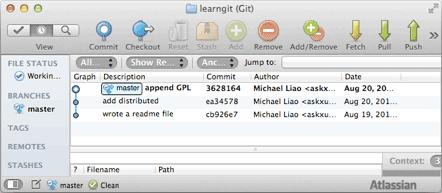

### 版本回退

-----------------
现在，你已经学会了修改文件，然后把修改提交到Git版本库，现在，再练习一次，修改readme.txt文件如下：
```
Git is a distributed version control system.
Git is free software distributed under the GPL.
```
然后尝试提交：
```
$ git add readme.txt
$ git commit -m "append GPL"
[master 3628164] append GPL
 1 file changed, 1 insertion(+), 1 deletion(-)
 ```
像这样，你不断对文件进行修改，然后不断提交修改到版本库里，就好比玩RPG游戏时，每通过一关就会自动把游戏状态存盘，如果某一关没过去，你还可以选择读取前一关的状态。有些时候，在打Boss之前，你会手动存盘，以便万一打Boss失败了，可以从最近的地方重新开始。Git也是一样，每当你觉得文件修改到一定程度的时候，就可以“保存一个快照”，这个快照在Git中被称为```commit```。一旦你把文件改乱了，或者误删了文件，还可以从最近的一个```commit```恢复，然后继续工作，而不是把几个月的工作成果全部丢失。

现在，我们回顾一下readme.txt文件一共有几个版本被提交到Git仓库里了：

版本1：wrote a readme file
```
Git is a version control system.
Git is free software.
```
版本2：add distributed
```
Git is a distributed version control system.
Git is free software.
```
版本3：append GPL
```
Git is a distributed version control system.
Git is free software distributed under the GPL.
```
当然了，在实际工作中，我们脑子里怎么可能记得一个几千行的文件每次都改了什么内容，不然要版本控制系统干什么。版本控制系统肯定有某个命令可以告诉我们历史记录，在Git中，我们用```git log```命令查看：
```
$ git log
commit 3628164fb26d48395383f8f31179f24e0882e1e0
Author: Michael Liao <askxuefeng@gmail.com>
Date:   Tue Aug 20 15:11:49 2013 +0800

    append GPL

commit ea34578d5496d7dd233c827ed32a8cd576c5ee85
Author: Michael Liao <askxuefeng@gmail.com>
Date:   Tue Aug 20 14:53:12 2013 +0800

    add distributed

commit cb926e7ea50ad11b8f9e909c05226233bf755030
Author: Michael Liao <askxuefeng@gmail.com>
Date:   Mon Aug 19 17:51:55 2013 +0800

    wrote a readme file
```
```git log```命令显示从最近到最远的提交日志，我们可以看到3次提交，最近的一次是```append GPL```，上一次是```add distributed```，最早的一次是```wrote a readme file```。
如果嫌输出信息太多，看得眼花缭乱的，可以试试加上```--pretty=oneline```参数：
```
$ git log --pretty=oneline
3628164fb26d48395383f8f31179f24e0882e1e0 append GPL
ea34578d5496d7dd233c827ed32a8cd576c5ee85 add distributed
cb926e7ea50ad11b8f9e909c05226233bf755030 wrote a readme file
```
需要友情提示的是，你看到的一大串类似```3628164...882e1e0```的是```commit id```（版本号），和SVN不一样，Git的```commit id```不是1，2，3……递增的数字，而是一个SHA1计算出来的一个非常大的数字，用十六进制表示，而且你看到的```commit id```和我的肯定不一样，以你自己的为准。为什么```commit id```需要用这么一大串数字表示呢？因为Git是分布式的版本控制系统，后面我们还要研究多人在同一个版本库里工作，如果大家都用1，2，3……作为版本号，那肯定就冲突了。

每提交一个新版本，实际上Git就会把它们自动串成一条时间线。如果使用可视化工具查看Git历史，就可以更清楚地看到提交历史的时间线：




好了，现在我们启动时光穿梭机，准备把readme.txt回退到上一个版本，也就是“add distributed”的那个版本，怎么做呢？

首先，Git必须知道当前版本是哪个版本，在Git中，用```HEAD```表示当前版本，也就是最新的提交```3628164...882e1e0```（注意我的提交ID和你的肯定不一样），上一个版本就是```HEAD^```，上上一个版本就是```HEAD^^```，当然往上100个版本写100个^比较容易数不过来，所以写成```HEAD~100```。

现在，我们要把当前版本“append GPL”回退到上一个版本“add distributed”，就可以使用```git reset```命令：
```
$ git reset --hard HEAD^
HEAD is now at ea34578 add distributed
```
```--hard ```参数有啥意义？这个后面再讲，现在你先放心使用。

看看readme.txt的内容是不是版本```add distributed```
```
$ cat readme.txt
Git is a distributed version control system.
Git is free software.
```
果然。

还可以继续回退到上一个版本```wrote a readme file```，不过且慢，然我们用```git log```再看看现在版本库的状态：
```
$ git log
commit ea34578d5496d7dd233c827ed32a8cd576c5ee85
Author: Michael Liao <askxuefeng@gmail.com>
Date:   Tue Aug 20 14:53:12 2013 +0800

    add distributed

commit cb926e7ea50ad11b8f9e909c05226233bf755030
Author: Michael Liao <askxuefeng@gmail.com>
Date:   Mon Aug 19 17:51:55 2013 +0800

    wrote a readme file
 ```
最新的那个版本```append GPL```已经看不到了！好比你从21世纪坐时光穿梭机来到了19世纪，想再回去已经回不去了，肿么办？

办法其实还是有的，只要上面的命令行窗口还没有被关掉，你就可以顺着往上找啊找啊，找到那个```append GPL```的```commit id```是```3628164...```，于是就可以指定回到未来的某个版本：
```
$ git reset --hard 3628164
HEAD is now at 3628164 append GPL
```
版本号没必要写全，前几位就可以了，Git会自动去找。当然也不能只写前一两位，因为Git可能会找到多个版本号，就无法确定是哪一个了。

再小心翼翼地看看readme.txt的内容：
```
$ cat readme.txt
Git is a distributed version control system.
Git is free software distributed under the GPL.
```
果然，我胡汉三又回来了。

Git的版本回退速度非常快，因为Git在内部有个指向当前版本的```HEAD```指针，当你回退版本的时候，Git仅仅是把HEAD从指向```append GPL```：


改为指向```add distributed```：


然后顺便把工作区的文件更新了。所以你让```HEAD```指向哪个版本号，你就把当前版本定位在哪。


 现在，你回退到了某个版本，关掉了电脑，第二天早上就后悔了，想恢复到新版本怎么办？找不到新版本的```commit id```怎么办？

在Git中，总是有后悔药可以吃的。当你用```$ git reset --hard HEAD^```回退到```add distributed```版本时，再想恢复到```append GPL```，就必须找到```append GPL```的```commit id```。Git提供了一个命令```git reflog```用来记录你的每一次命令：
```
$ git reflog
ea34578 HEAD@{0}: reset: moving to HEAD^
3628164 HEAD@{1}: commit: append GPL
ea34578 HEAD@{2}: commit: add distributed
cb926e7 HEAD@{3}: commit (initial): wrote a readme file
```
终于舒了口气，第二行显示```append GPL```的```commit id```是```3628164```，现在，你又可以乘坐时光机回到未来了。

小结

现在总结一下：

```HEAD```指向的版本就是当前版本，因此，Git允许我们在版本的历史之间穿梭，使用命令```git reset --hard commit_id```。

穿梭前，用git log可以查看提交历史，以便确定要回退到哪个版本。

要重返未来，用git reflog查看命令历史，以便确定要回到未来的哪个版本。